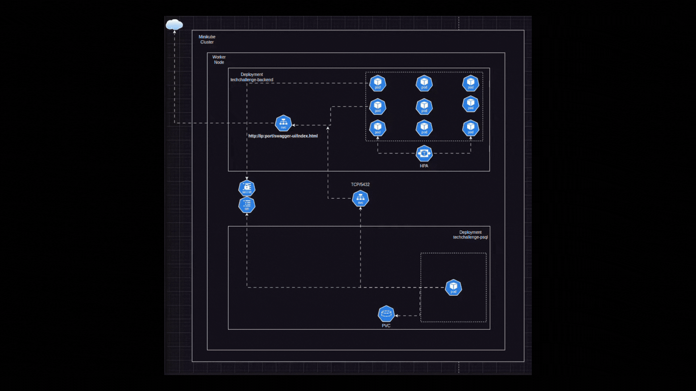
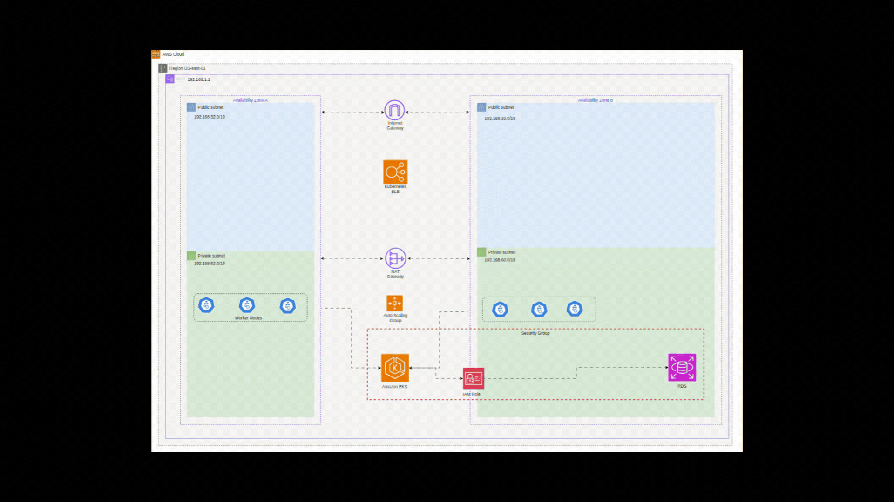

# 💡 1. Introdução

## Objetivo ##
Este projeto tem como objetivo gerenciar todos os pedidos de uma lanchonete. Desde o início, com o cadastro de usuários, seleção de itens e pagamento, até o acompanhamento/atualização do status pela cozinha e notificação para retirada pelo cliente.

### Como executar o Projeto Localmente?

Para rodar o sistema localmente, você precisará de:

- Uma IDE compatível, como IntelliJ IDEA, Eclipse, ou VS Code, para baixar e abrir o repositório.
- [Docker](https://docs.docker.com/engine/install/), [Kubernetes](https://kubernetes.io/docs/setup/), e [Minikube](https://kubernetes.io/docs/tasks/tools/#minikube) instalados para a execução da infraestrutura.
- [K6](https://grafana.com/docs/k6/latest/set-up/install-k6/) instalado para execução do *stress-test* (opcional).

### Inicie o Minikube:
Abra o terminal, navegue até a pasta `iac` dentro do repositório, e execute os comandos:

```bash
minikube-start
```

```bash
minikube addons enable metrics-server
```

Isso criará um Cluster Kubernetes local e habilitará o *Metric Server* no Minikube.

### Deploy dos Manifestos do Kubernetes:
Após a criação do Cluster, aplique todos os manifestos executando:

```bash
kubectl apply -f kubernetes
```

### Verifique o Status dos Pods:
Acompanhe o status dos pods até que todos estejam com o status `Running`:

```bash
kubectl get pods
```

### Exponha o Serviço Backend:
Para expor o serviço do backend, execute:

```bash
minikube service techchallenge-backend --url
```

Esse comando gerará uma *URL*. Copie a URL fornecida e adicione ***/swagger-ui/index.html*** no final, então cole-a no seu navegador para acessar a documentação do *Swagger UI*.

```bash
EXEMPLO: url/swagger-ui/index.html
```

**Importante:** A janela do terminal onde você executou o comando `minikube service techchallenge-backend --url` deve permanecer aberta enquanto os endpoints da API estiverem ativos.

### Limitações de NodePort no Minikube:
No Minikube, há uma limitação que impede a definição de um NodePort fixo, mesmo que configurado no manifesto `service.yaml`. Por isso, o comando `minikube service techchallenge-backend --url` é necessário para expor o serviço corretamente.

### Stress Test
Para executar um teste de carga, vá até o diretório raiz do repositório e uma vez que todos os passos anteriores foram executados altere somente a url onde o K6 irá executar o teste, levando em consideração as mesmas informações citadas no passo **Expor o Serviço Backend**.

Em seguida execute o comando:

```bash
k6 run stress-test
```

Após isso uma janela irá abrir com o status do teste em tempo real. É possível acompanhar o status e a quantidade de Pods em execução com o comando `kubectl get pods -w` e também podemos ter uma visão a nível de recursos utilizados com o comando `kubectl top pods`.


# 🌟  2. Arquitetura 

## Visão Geral: ##
O sistema é construído utilizando Java com Spring Boot, e a imagem Docker utilizada pelo `techchalenge-backend` é gerada automaticamente usando o `Dockerfile` e enviada ao *DockerHub*. No momento do apply dos manifestos, a imagem é baixada e o banco de dados é configurado automaticamente realizando também um *pull* de sua respectiva imagem.


- **Resiliência:** Os Pods e configurações adicionais, como *Probes*, *Resources* e quantidades de *Replicas* são definidos no arquivo de `deployment.yaml`, seguindo as melhores práticas recomendadas para Kubernetes.
- 
- **Configuração** Todos os parâmetros de configurações necessários para o deploy da aplicação e do banco de dados são especificados no `configmap.yaml`.
- 
- **Segurança** Informações sensíveis foram armazenados no `secrets.yaml`, com os dados devidamente encriptados utilizando o tipo *opaque*.
- 
- **Persistência de Dados:** O uso de um *PersistentVolumeClaim* (`pvc.yaml`) garante a persistência dos dados do banco de dados, preservando-os mesmo em caso de reinicialização dos Pods.
- 
- **Escalabilidade:** O sistema utiliza um *Horizontal Pod Autoscaler* (`hpa.yaml`) para ajustar automaticamente a quantidade de réplicas dos pods conforme a carga de trabalho.
- 
- **Nuvem** Por último um exemplo de como ficaria esta arquitetura em uma nuvem da AWS. Sendo que a mesma arquitetura local apresentada, pode ser facilmente adaptada para rodar em providores de nuvem como a AWS por exemplo.

### 2.2 Diagrama de Arquitetura:

***Arquitetura Local***


***Arquitetura em Nuvem***


# 📦 3. Domínios e Entidades

## 3.1 Cliente ##

### Atributos:
- **id (Long):** Identificador único do cliente.
- **email (String):** Endereço de e-mail do cliente.
- **nome (String):** Nome do cliente.Funcionalidades.
- **cpf (String):** CPF do cliente.

### Relacionamentos:
- **Pedidos:** Um cliente pode ter vários pedidos. Este é um relacionamento um-para-muitos com a entidade Pedido.

### Funcionalidades:
- Criar, atualizar e deletar informações de clientes.
- Validar informações do cliente antes do armazenamento.
- Buscar informações detalhadas do cliente.

## 3.2 Produto 

### Atributos:
- **id (Long):** Identificador único do produto.
- **nome (String):** Nome do produto.
- **descricao (String):** Descrição detalhada do produto.
- **valor (Double):** Preço do produto.
- **categoriaProduto:** Categoria do produto, como Lanche, Bebida, etc.

### Relacionamentos:
- **Itens de Pedido:** Um produto pode estar associado a vários pedidos. Relacionamento muitos-para-muitos através da entidade Pedido.

### Funcionalidades:
- Criar, atualizar e deletar produtos.
- Buscar produtos por categoria.
- Validar as informações do produto antes de salvar.

## 3.3 Pedido

### Atributos:
- **id (Long):** Identificador único do pedido.
- **numero (String):** Número de referência do pedido.
- **valorTotal (Double):** Valor total do pedido.
- **statusPedido (StatusPedido):** Estado atual do pedido, como Recebido, Em Preparação e etc.

### Relacionamentos:
- **Cliente:** Cada pedido é feito por um cliente. Relacionamento muitos-para-um.
- **Itens de Pedido:** Um pedido contém vários itens.

### Funcionalidades:
- Processar novos pedidos.
- Atualizar o status do pedido.
- Calcular o valor total do pedido com base nos itens incluídos.

## 3.4 Item

### Atributos:
- **id (Long):** Identificador único do item de pedido.
- **quantidade (Integer):** Quantidade do produto pedido.
- **valorItem (Double):** Preço do item baseado no produto e na quantidade.

### Relacionamentos:
- **Produto:** Cada item de pedido está associado a um produto específico. Relacionamento muitos-para-um.
- **Pedido:** Cada item está associado a um pedido. Relacionamento muitos-para-um.

### Funcionalidades:
- Calcular o custo total do item com base na quantidade e no preço do produto.
- Validar a quantidade do produto (não deve ser zero ou negativa).


# 📚 4 Documentação da API 

Este documento descreve os endpoints disponíveis na API, suas funcionalidades e como utilizá-los.

⚠️ **Avisos**
- Antes de realizar as chamadas de API, execute a infraestrutura local conforme passo **1.3 "Como executar o Projeto Localmente?"**.
- Para metodos de PUT e POST não é necessário incluir o *id*.


**🌐 Swagger**
Você pode acessar a documentação interativa da API via Swagger pelo seguinte link: [Swagger UI](http://localhost:9090/swagger-ui/index.html).

## Endpoints

### 4.1 Cliente

- **Criar Cliente**
  - **Descrição:** Cria um novo cliente no sistema.
  - **Endpoint:** `POST /api/clientes`
  - **Corpo da Requisição:**
  
    ```json
    {
      "email": "string",
      "nome": "string",
      "cpf": "string"
    }
    ```
  - **Resposta de Sucesso:** `201 Created`

    ```json
    {
      "id": "number",
      "email": "string",
      "nome": "string",
      "cpf": "string"
    }
    ```

- **Listar Clientes**
  - **Descrição:** Retorna uma lista de todos os clientes cadastrados.
  - **Endpoint:** `GET /api/clientes`
  - **Resposta de Sucesso:** `200 OK`

    ```json
    [
      {
        "id": "number",
        "email": "string",
        "nome": "string",
        "cpf": "string"
      }
    ]
    ```

- **Obter Cliente por CPF**
  - **Descrição:** Retorna os dados de um cliente específico pelo CPF.
  - **Endpoint:** `GET /api/clientes/{cpf}`
  - **Parâmetro de Caminho:** `{cpf}` - CPF do cliente a ser buscado.
  - **Resposta de Sucesso:** `200 OK`

    ```json
    {
      "id": "number",
      "email": "string",
      "nome": "string",
      "cpf": "string"
    }
    ```

- **Deletar Cliente**
  - **Descrição:** Exclui um cliente do sistema.
  - **Endpoint:** `DELETE /api/clientes/{id}`
  - **Parâmetro de Caminho:** `{id}` - ID do cliente a ser deletado.
  - **Resposta de Sucesso:** `204 No Content`

### 4.2 Produto

**CATEGORIA**
* LANCHE
* ACOMPANHAMENTO
* BEBIDA
* SOBREMESA

- **Criar Produto**
  - **Descrição:** Adiciona um novo produto ao sistema.
  - **Endpoint:** `POST /api/produtos`
  - **Corpo da Requisição:**

    ```json
    {
      "nome": "string",
      "descricao": "string",
      "valor": "number",
      "categoriaProduto": "string"
    }
    ```
  - **Resposta de Sucesso:** `201 Created`

    ```json
    {
      "id": "number",
      "nome": "string",
      "descricao": "string",
      "valor": "number",
      "categoriaProduto": "string"
    }
    ```

- **Listar Produtos**
  - **Descrição:** Retorna uma lista de todos os produtos cadastrados.
  - **Endpoint:** `GET /api/produtos`
  - **Resposta de Sucesso:** `200 OK`

    ```json
    [
      {
        "id": "number",
        "nome": "string",
        "descricao": "string",
        "valor": "number",
        "categoriaProduto": "string"
      }
    ]
    ```

- **Obter Produto por ID**
  - **Descrição:** Retorna os dados de um produto específico pelo ID.
  - **Endpoint:** `GET /api/produtos/{id}`
  - **Parâmetro de Caminho:** `{id}` - ID do produto a ser buscado.
  - **Resposta de Sucesso:** `200 OK`
  
    ```json
    {
      "id": "number",
      "nome": "string",
      "descricao": "string",
      "valor": "number",
      "categoriaProduto": "string"
    }
    ```

- **Listar Produtos por Categoria**
  - **Descrição:** Retorna os produtos que pertencem a uma determinada categoria.
  - **Endpoint:** `GET /api/produtos/categoria/{categoriaProduto}`
  - **Parâmetro de Caminho:** `{categoriaProduto}` - Categoria dos produtos a serem buscados.
  - **Resposta de Sucesso:** `200 OK`

    ```json
    [
      {
        "id": "number",
        "nome": "string",
        "descricao": "string",
        "valor": "number",
        "categoriaProduto": "string"
      }
    ]
    ```

- **Atualizar Produto**
  - **Descrição:** Atualiza as informações de um produto existente.
  - **Endpoint:** `PUT /api/produtos/{id}`
  - **Parâmetro de Caminho:** `{id}` - ID do produto a ser atualizado.
  - **Corpo da Requisição:**

    ```json
    {
      "nome": "string",
      "descricao": "string",
      "valor": "number",
      "categoriaProduto": "string"
    }
    ```
  - **Resposta de Sucesso:** `200 OK`
  
    ```json
    {
      "id": "number",
      "nome": "string",
      "descricao": "string",
      "valor": "number",
      "categoriaProduto": "string"
    }
    ```

- **Deletar Produto**
  - **Descrição:** Remove um produto do sistema.
  - **Endpoint:** `DELETE /api/produtos/{id}`
  - **Parâmetro de Caminho:** `{id}` - ID do produto a ser deletado.
  - **Resposta de Sucesso:** `204 No Content`

### 4.3 Pedido

- **Iniciar Novo Pedido**
  - **Descrição:** Cria um novo pedido no sistema.
  - **Endpoint:** `POST /api/pedidos`
  - **Corpo da Requisição:**
  
    ```json
    {
      "clienteId": "number",
      "itens": [
        {
          "quantidade": "number",
          "produto": {
            "id": "number"
          }
        }
      ]
    }
    ```
  - **Resposta de Sucesso:** `201 Created`
  
    ```json
    {

      "clienteId": "number",
      "itens": [
        {
          "quantidade": "number",
          "produto": {
            "id": "number",
            "nome": "string",
            "descricao": "string",
            "valor": "number",
            "categoriaProduto": "string"
          }
        }
      ]
    }
    ```

- **Listar Pedidos**
  - **Descrição:** Retorna uma lista de todos os pedidos realizados.
  - **Endpoint:** `GET /api/pedidos`
  - **Resposta de Sucesso:** `200 OK`

    ```json
    [
      {
        "id": "number",
        "numero": "number",
        "dataPedido": "string",
        "valorTotal": "number",
        "statusPedido": "string",
        "cliente": {
          "id": "number",
          "email": "string",
          "nome": "string",
          "cpf": "string"
        },
        "itens": [
          {
            "id": "number",
            "quantidade": "number",
            "valorItem": "number",
            "produto": {
              "id": "number",
              "nome": "string",
              "descricao": "string",
              "valor": "number",
              "categoriaProduto": "string"
            }
          }
        ]
      }
    ]
    ```